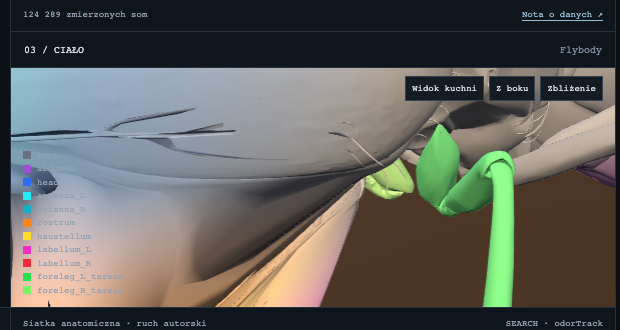
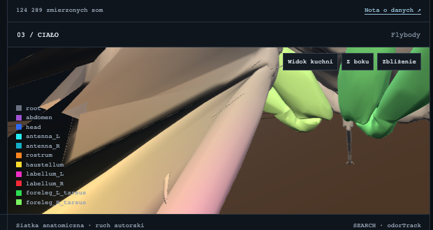
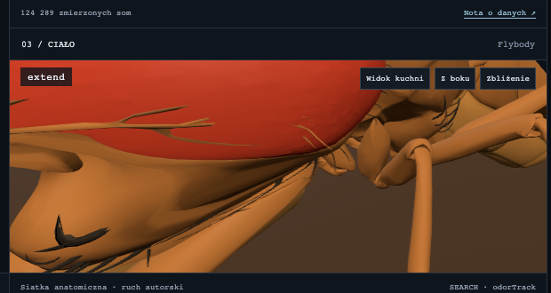
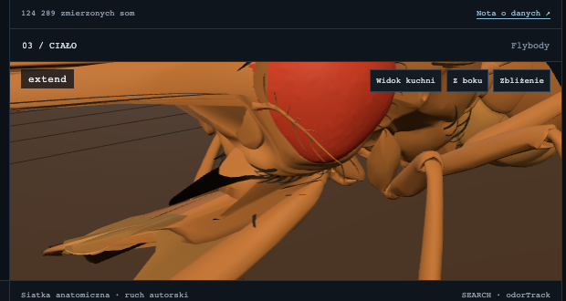

# Faza 4 fix — mouthpart weight bleed

Do not start Faza 5.

Full-page stills re-rendered: `01-debug-weights.png`, `02-extend-closeup.png`.
Panel crops below are the same frames, clipped to **03 / CIAŁO** so the mesh is readable.

## Cause

The PER clip was already rotating about **−X** (left–right). That is the correct anatomical pitch: the labellum tip moves **+Z (anterior)** and **−Y (ventral)** with **dX = 0**. Yaw or roll about Y/Z is what would splay the tip sideways.

The eye/antenna drag was skinning:

- Rostrum `radius` 0.026 sat **1.7 mm** (model units) short of the nearest `red` eye vertex (0.0277) but **inside** the eye-socket cuticle (0.0161) and the antenna `black` cloud (0.018). 189 eye-region `body` verts and 289 antenna verts were in range.
- Linear falloff then **renormalized the top-4 to sum 1**, so a vertex with a tiny rostrum weight became 100 % mouthpart.
- There was no material mask. Flybody names the compound-eye part **`red`**, ocelli **`ocelli`**.

## Derived `maxRadius` (model units)

Mesh AABB from `public/data/flybody/model.bin`:

| | X | Y | Z |
| --- | --- | --- | --- |
| min | −0.3058 | −0.1319 | −0.1927 |
| max | 0.3058 | 0.0517 | 0.1085 |
| size | 0.6116 | 0.1836 | 0.3012 |

Diagonal **0.706**. Mouthpart caps = stay below min distance to eyes / ocelli / thorax, and for rostrum also below the antenna cloud (0.018) and eye-socket cuticle (0.0161).

| bone | → eyes (`red`) | → ocelli | → thorax | **maxRadius** |
| --- | --- | --- | --- | --- |
| root | 0.0657 | 0.0837 | 0.0388 | **0.120** |
| abdomen | 0.2036 | 0.2322 | 0.0740 | **0.070** |
| head | 0.0273 | 0.0221 | 0.0406 | **0.038** |
| antenna_L / R | 0.0109 | 0.0264 | 0.0639 | **0.0095** |
| **rostrum** | 0.0277 | 0.0609 | 0.0418 | **0.016** |
| **haustellum** | 0.0358 | 0.0756 | 0.0431 | **0.018** |
| **labellum_L** | 0.0367 | 0.0866 | 0.0440 | **0.014** |
| **labellum_R** | 0.0368 | 0.0866 | 0.0440 | **0.014** |
| foreleg_* | — | — | — | **0** (parented, not skinned) |

Rostrum 0.016 still covers anterior mouth `lower` (nearest 0.0082). Labellum 0.014 covers `bristle-brown` (max 0.0088).

## Weighting changes

1. `weight = 1 - smoothstep(0, maxRadius, d)`, hard zero at/beyond `maxRadius`.
2. If raw weights sum to more than 1, scale them down. Deficit goes to **root** so Three.js LBS does not implode the vertex. Packed influences still sum to 1.
3. Mouthpart bones (`rostrum`, `haustellum`, `labellum_L`, `labellum_R`) set `excludeMaterials: ["eyes", "ocelli"]`. `eyes` aliases to Flybody material `red`. Those parts get **zero** mouthpart weight regardless of distance.

## PER axis

**Unchanged.** Clips still pitch about **−X**.

Labellum offset from rostrum `[0.0141, −0.0229, −0.0123]`, Rx(−35°): **dX = 0, dY = −0.0029, dZ = +0.0154** (ventral, anterior). Rx(+35°) folds up/back. Ry(−35°) produces a sideways dX.

## `?debug=weights`

<table>
<tr><th>Before</th><th>After</th></tr>
<tr>
<td></td>
<td></td>
</tr>
</table>

Before: the close-up is the compound-eye cuticle, washed with mouthpart colours (the eye had been pulled into the labellum camera). After: the same camera sits on the actual mouthparts — orange `rostrum`, yellow `haustellum`, magenta/pink `labellum_*`. Head/eye stay out of those bones.

Full page: `01-debug-weights.png` (old copy: `01-debug-weights-before.png`).

## `?debug=extend` (mid-PER)

<table>
<tr><th>Before</th><th>After</th></tr>
<tr>
<td></td>
<td></td>
</tr>
</table>

Before: the red eye fills the frame and the cuticle around it is dragged toward the mouth. After: the eye stays a compact oval on the head; antennae stay put; the hanging mouthparts pitch forward/down. No sideways splay.

Full page: `02-extend-closeup.png` (old copy: `02-extend-closeup-before.png`).

## Manual check

```
npm run lint && npm test && npm run build
```

Then:

- `/?debug=weights` — orange/pink confined to the ventral mouth; compound eye not tinted mouthpart.
- `/?debug=extend` — eye glued to the head; tip moves anterior/ventral, not left/right.

## Out of scope

Faza 5 was **not** started.
